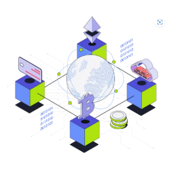
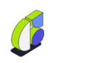
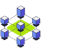
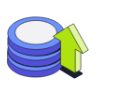

CoinSwitch Webpage
This project is a simple webpage for CoinSwitch, a platform focusing on Web3 and blockchain. It introduces CoinSwitch's mission, services, and features, providing an overview of their offerings.

Features
Responsive Design: The page is built with flexibility in mind, ensuring it displays well on different devices.
Main Content: Highlights the company's mission and values.
Why It Matters Section: Provides key reasons why CoinSwitch is important, using icons and text for visual appeal.
Step-by-Step Code Explanation
1. HTML Structure (index.html)
This is the main structure of the webpage.

Header
The header contains the company logo and navigation links:

html
Copy code
<header class="header">
  

    
    coinswitch
  

  <nav class="nav">
    <a href="#">Products</a>
    <a href="#">Coins</a>
    <a href="#">Ventures</a>
    <a href="#">Blog</a>
    <a href="#">Company</a>
    <a class="login" href="#">Login To Pro</a>
  </nav>
</header>
Logo: Displays the CoinSwitch logo.
Navigation: Includes links to various sections like Products, Coins, Ventures, and more.
Main Content
This section contains a heading, a description, and an image.

html
Copy code

  

    <h1>We believe that Web3 and blockchain are the foundations of the new digital, decentralized economy.</h1>
    
To this end, we're partnering with startups that are advancing the future of Blockchain technology. We provide early stage founders with the capital, network connections, and advice to transform the Web3 landscape in India.

  

  

    
  

Text: Displays a bold headline and a paragraph explaining CoinSwitch's mission.
Image: Shows an illustration related to blockchain technology.
Why It Matters Section
This section highlights key features in a visually appealing manner using icons and brief descriptions.

html
Copy code

  <h2>Why it Matters?</h2>
  

    

      
      
Partnership with India's largest wealth tech destination

    

    

      
      
Access to a network of 70+ global venture capital partners

    

    

      
      
Capital infusion up to $250,000

    

    

      
      
Mentorship from in-house experts

    

  

Features: Four key features are displayed using icons and descriptions, including partnership, network, capital, and mentorship.
2. CSS Styling
The CSS is embedded within the index.html file and defines the style for each section:

css
Copy code
body {
  font-family: 'Roboto', sans-serif;
  background-color: #ffffff;
  color: #333333;
}

.header {
  display: flex;
  justify-content: space-between;
  padding: 20px 50px;
}

.main-content .text {
  max-width: 500px;
}
Font: Uses the Google Font "Roboto" for a modern look.
Color Scheme: Light background with dark text for readability.
Flexbox: Flexbox is used for layout management, aligning items horizontally and vertically.
How to Run the Project
Clone the repository:
bash
Copy code
git clone https://github.com/YOUR-USERNAME/coinswitch-webpage.git
Navigate to the project directory:
bash
Copy code
cd coinswitch-webpage
Open the index.html file in your preferred browser:
bash
Copy code
open index.html
Technologies Used
HTML5
CSS3
Font Awesome (for icons)
Google Fonts (for typography)
Future Enhancements
Add interactive elements such as hover effects.
Implement a working login page for the "Login to Pro" link.
Optimize the webpage for faster loading speeds.
Feel free to replace YOUR-USERNAME with your actual GitHub username. Let me know if you'd like any changes or additional details!

